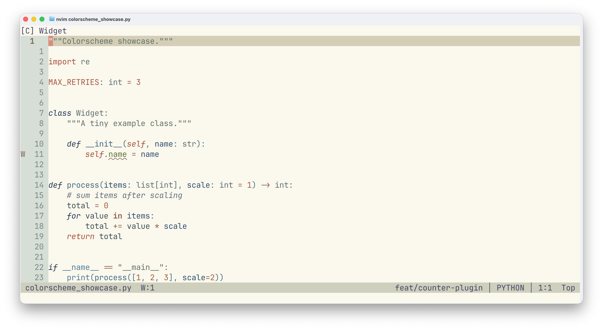
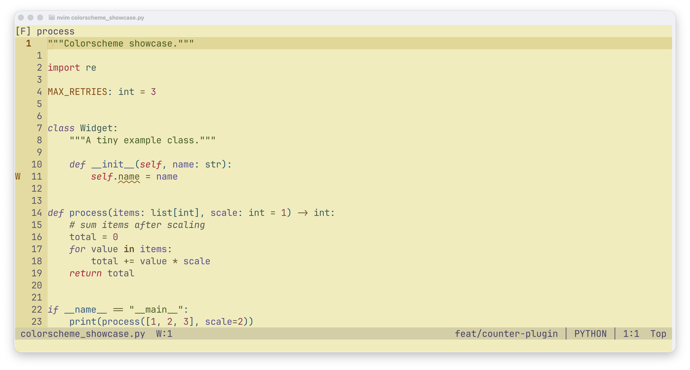

# kanagawa-fuji.nvim


I'm a huge fan of [kanagawa.nvim](https://github.com/rebelot/kanagawa.nvim) -
I've been using it for a while and genuinely love it. My only issue was its
light variant: I found it hard to read, and it turns out stock
`kanagawa-lotus` fails WCAG AA contrast on most of its syntax colors
against its own background.

kanagawa-fuji.nvim fixes that with two contrast- and hue-tuned takes on
`lotus`, each inspired by a different print from Hokusai's *Thirty-Six
Views of Mount Fuji*:

- **fuji** - inspired by *South Wind, Clear Sky* ("Red Fuji"). Keeps the
  same soft, paper-like aesthetic but darkens/saturates/rotates the accent
  colors that need it. See [PALETTE.md](PALETTE.md) for the full color
  table.
- **nami** - inspired by *The Great Wave off Kanagawa*. Only moves
  lightness relative to stock lotus - hue and chroma stay fixed, so it
  keeps lotus's full, saturated hue set rather than narrowing it.

| fuji | nami |
| --- | --- |
|  |  |

This is **not** a fork of kanagawa.nvim and doesn't vendor any of its
code - fuji and nami are each registered as one more kanagawa theme,
reusing its `lotus` builder, and both depend on kanagawa.nvim being
installed.

There are two ways to use either theme:

- **As a colorscheme** - `:colorscheme kanagawa-fuji` or
  `:colorscheme kanagawa-nami`, sitting alongside kanagawa's own `wave`,
  `dragon` and `lotus`.
- **As a `lotus` override** - keep `:colorscheme kanagawa` and let this
  plugin swap its light variant for fuji or nami, so `background=light`
  gives you that theme while `wave` and `dragon` stay untouched.

## Requirements

- [kanagawa.nvim](https://github.com/rebelot/kanagawa.nvim)

## Installation

Install both plugins; pick a mode from [Usage](#usage) below.

With `vim.pack` (Neovim 0.12+):

```lua
vim.pack.add({
	"https://github.com/rebelot/kanagawa.nvim",
	"https://github.com/menisadi/kanagawa-fuji.nvim",
})
```

With [lazy.nvim](https://github.com/folke/lazy.nvim):

```lua
{
	"menisadi/kanagawa-fuji.nvim",
	dependencies = { "rebelot/kanagawa.nvim" },
	priority = 1000,
	config = function()
		-- see Usage below
	end,
}
```

## Usage

### fuji

#### As a colorscheme

```lua
vim.cmd.colorscheme("kanagawa-fuji")
```

That's it - `colors/kanagawa-fuji.lua` registers `fuji` as a kanagawa
theme of its own, tuned from `lotus`, and loads it.

#### As a `lotus` override

```lua
require("kanagawa-fuji").setup()
vim.cmd.colorscheme("kanagawa")
```

A light `background` resolves to fuji instead of lotus, while `wave` and
`dragon` stay untouched. Stock lotus is still there as
`:colorscheme kanagawa-lotus`.

### nami

#### As a colorscheme

```lua
vim.cmd.colorscheme("kanagawa-nami")
```

That's it - `colors/kanagawa-nami.lua` registers `nami` as a kanagawa
theme of its own, tuned from `lotus`, and loads it.

#### As a `lotus` override

```lua
require("kanagawa-nami").setup()
vim.cmd.colorscheme("kanagawa")
```

A light `background` resolves to nami instead of lotus, while `wave` and
`dragon` stay untouched. Stock lotus is still there as
`:colorscheme kanagawa-lotus`.

## Credits

- [kanagawa.nvim](https://github.com/rebelot/kanagawa.nvim) by
  [rebelot](https://github.com/rebelot) - both variants reuse its `lotus`
  theme builder rather than vendoring any code.
- Katsushika Hokusai, *South Wind, Clear Sky* ("Red Fuji"), from
  *Thirty-Six Views of Mount Fuji* - inspiration for fuji.
- Katsushika Hokusai, *The Great Wave off Kanagawa*, from *Thirty-Six
  Views of Mount Fuji* - inspiration for nami.
